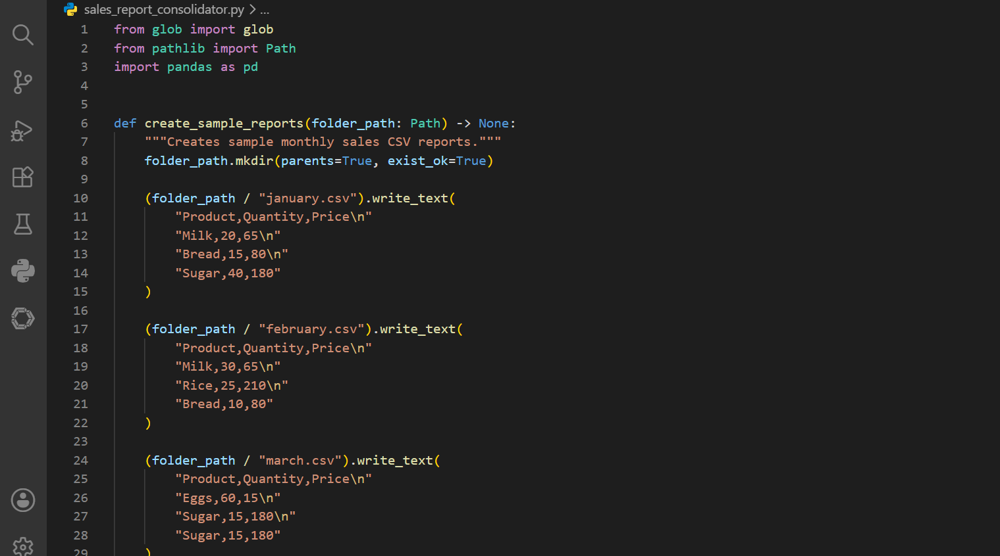
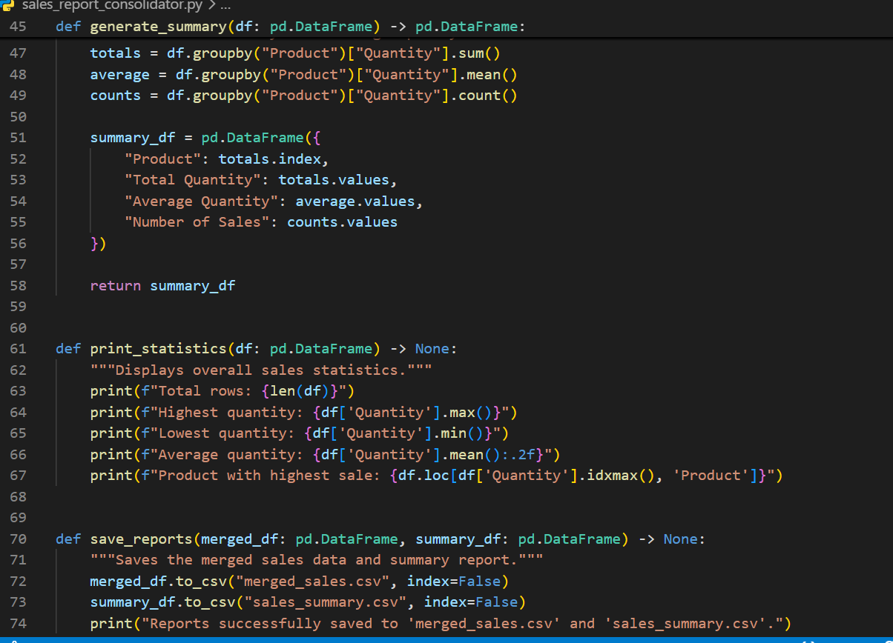
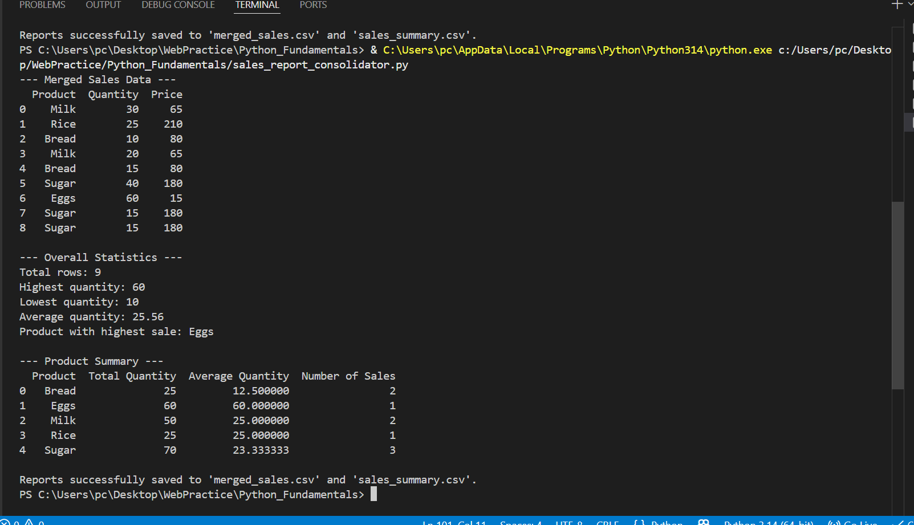

# Sales Report Consolidator

A Python automation tool that combines multiple monthly sales CSV files into a single dataset, calculates sales statistics, generates a product-level summary, and exports the results as CSV reports.

## What This Project Does

This project automates a common reporting task: consolidating sales data stored across multiple CSV files.

The script:

1. Creates sample monthly sales reports.
2. Finds all CSV files inside the `sample_data` directory.
3. Loads the reports using Pandas.
4. Combines the data into one DataFrame.
5. Calculates overall sales statistics.
6. Generates a product-level sales summary.
7. Exports the merged data and summary as CSV files.

## Technologies Used

* Python
* Pandas
* pathlib
* glob
* CSV

## Project Structure

```text
sales-report-consolidator/
│
├── output/
│   ├── merged_sales.csv
│   └── sales_summary.csv
│
├── sample_data/
│   ├── january.csv
│   ├── february.csv
│   └── march.csv
│
├── screenshots/
│   ├── 01_code_setup.png
│   ├── 02_processing_reporting.png
│   └── 03_successful_execution.png
│
├── README.md
└── sales_report_consolidator.py
```

## Example Input

The project uses monthly CSV files containing:

```text
Product,Quantity,Price
Milk,20,65
Bread,15,80
Sugar,40,180
```

Multiple monthly files can be combined into a single report.

## Generated Reports

### Merged Sales Report

`output/merged_sales.csv`

Contains the consolidated records from all monthly sales files.

### Sales Summary

`output/sales_summary.csv`

Provides product-level statistics including:

* Total quantity
* Average quantity
* Number of sales

## Example Statistics

The sample dataset produces:

```text
Total rows: 9
Highest quantity: 60
Lowest quantity: 10
Average quantity: 25.56
Product with highest sale: Eggs
```

## How to Run

### 1. Clone the repository

```bash
git clone https://github.com/georgesorrowist170-sudo/sales-report-consolidator.git
```

### 2. Install Pandas

```bash
pip install pandas
```

### 3. Run the script

```bash
python sales_report_consolidator.py
```

The generated reports will be saved as:

```text
output/
├── merged_sales.csv
└── sales_summary.csv
```

## Screenshots

### Code Setup



### Processing and Reporting



### Successful Execution



## Skills Demonstrated

This project demonstrates practical Python automation skills including:

* Functions
* File and folder handling
* CSV processing
* Pandas DataFrames
* Data aggregation with `groupby()`
* DataFrame concatenation
* Statistical calculations
* Report generation
* Exporting processed data
* Organizing a Python project for portfolio use

## Purpose

This project was built as a practical example of automating repetitive sales-report consolidation tasks with Python and Pandas.

